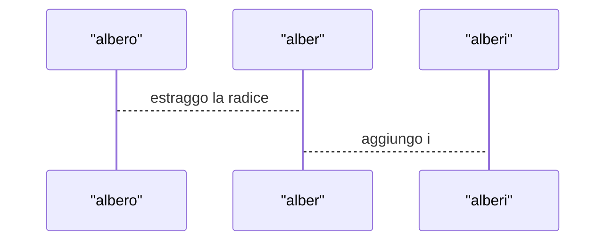

# astrazione procedurale
##### (esem. 1.3.1.scm)

    calcolare la superfice totale di un cilindro

    raggio di base 0.9 cm
    altezza 2.5 cm

(+ (* 2 (* pi (* 0.9 0.9))) (* (* pi (* 0.9 2)) 2.4))

(+ (* 2 (* pi (* rb rb))) (* (* pi (* rb 2)) h))

    semplificato:
    2*rb*pi*(h + rb)
    (* 2 (* pi (* rb (+ h rb))))

sintatticamente sono corrette, ma non semanticamente perché i due paremetri non sono definiti, non vogliono dire niente

(lambda (rb h) (* 2 (* pi (* rb (+ h rb)))) )

    il simbolo lambda si utilizza per motivi storici,  mac cartey usa le lambda expression per la programmazione funzionale,
    scrivendo il nome per esteso perché il simbolo non è presente nella tastiera

* l'espressione lambda esplicita i parametri ed il loro ordine.
* l'espressione lambda assume come valore una funzione, non ha nome, ha solo come vaolore una procedura.

    N.B. quello che si fa con le lambda in scheme è l'equivalente delle funzioni negli altri linguaggi
    si chiamano procedure e quello che negli alri linguaggi sono le procesure non esise in scheme
    quindi non c'è il problema dell'ambiguità dei nomi

eseguo la mia lambda espressione mettendo l'espressione tra parentesi dove prima avrei messo il segno dell'operzione seguita dagli argomenti in ordine,
dove prima avrei messo i parametri dell'operazione matematica.

( (lambda (rb h) (* 2 (* pi (* rb (+ h rb)))) ) 0.9 2.4)

(+ 1 3)

la differenza tra le due sta nel fatto che per la somma non devo esplicitare la procedura dell'operazione  perché è già definita
viene mantenuta una certa analogia strutturale.

il simbolo labda indica loperazione di astrazione procedurale

con l'operazione di define possiamo assegnare un nome ad una costante numerica o ad una espressione

```scheme
(define sup-tot-cil
    (lambda (rb h)
        (* 2 (* pi (* rb (+ h rb))))
        )
    )
```
---
Esercizio:

    porta i nomi al plurale

##### (esem. 1.3.2.scm)



definisco due procedure:
* radice (dal primo al penultimo carattere, in base alla lunghezza del testo)
* aggiungi (la lettera "i" alla radice estratta)

aggiungi una  funzionalità, la procedura declina anche i nomi femminili
* creo una procedura che riconosca se un nome è femminile o maschile

per farlo usa questo:

```scheme
    (string=? (substring p (- (string-length p) 1)) "a" )
```

oppure: 

```scheme
    (char=? (string-ref p (- (string-length p) 1)) #\a)  
```

##### (fig. 1.3.1)

l'operazione di selezione (if) permette di effettuare una od un'altra operazione a seconda che un'espressione booleana sia vera oppure falsa

```scheme
(if <espressione booleana>
    <espressione then>
    <espressione else>
    )
```

è importante che le due espressioni restituiscano lo stesso tipo in ogni caso
alla fine l'espressione assume un valore, non come negli altri linguaggio in cui esegue solo delle operazioni, è più simile alla notazoine ternaria

---
---
##### (esem. 1.3.3.rkt)
    declina i verbi al participio passato