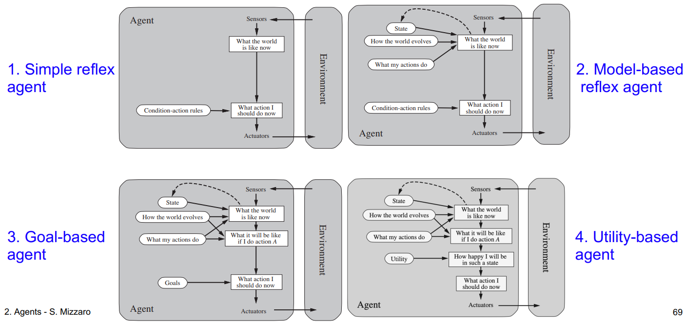

# Concepts

## Task environments

1. fully/partially observable
2. single/multi agent
3. deterministic/non-deterministic/stochastic
4. episodic/sequential
5. static/dynamic/semidynamic
6. discrete/continuous
7. known/unknown
8. (competitive/collaborative)

*physics of the environment*: what the actions do

## Agent

perceives and acts in an environment

function: [percept] $\mapsto$ action
program: implements the function

rational: maximize performance measure

* **P**erformance measure
* **E**nvironment
* **A**ctuator
* **S**ensors

## Types of agents

1. simple reflex
2. model-based
3. goal-based
4. utility-based
5. learning
   * performance element
   * learning element
   * critic
   * problem generator

### Spectrum

1. atomic
2. factored
3. structured

## Search problem

1. state space $S$
2. initial state $s_0$
3. action for each state $A(s)$
4. transition model $s_{i+1}=result(s_i,a)$
5. goal test $G(s)$
6. action cost $c(s_i,a,s_{i+1})$

a *solution* is an action sequence that reaches a goal state, an *optimal solution* has least cost among all solutions.

## Games

1. initial state $s_0$
2. $player(s)$: whose turn it is
3. $actions(s)$
4. result(s,a): transition model
5. $terminal-test(s)$
6. $utility(s,p)$: best score at $s$ for $p$

* zero-sum
* general sum

## Prompt engineering:

Tactics:

1. clear and specific instructions (delimiters)
2. ask the model to check/enforce prompt conditions
3. few-shot prompting (examples)

## Le 7 meraviglie degli LLM

1. classification
2. search
3. clustering
4. generation
5. summarize
6. extraction
7. rewriting
