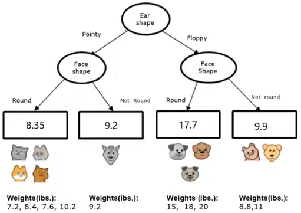

# Decision trees

Every node is a feature:

## Decision tree learning

### How to choose which feature to split at each node?

maximize purity, choose feature with highest information gain:

$$
H(p_{root})-\bigl(w_{left}H(p_{left})+w_{right}H(p_{right})\bigl)
$$

$$
H(P)=\sum_{i=0}^kp_i\cdot \log_2\frac 1{p_i}\\[1em]

H(p)=-p\log_2(p)-(1-p)\log_2(1-p)
$$

<!--  -->

Non-binary features: split each class in a standalone binary feature.

Continuous features: find the treshold with maximal information gain. The training dataset is finite, thus potential tresholds are finite too.

#### Regression with decision trees

Decision trees can be used to estimate a continuous (non categorical) feature. Instead of the information gain we use the variance gain:

$$
VAR(p_{root})-\bigl(w_{left}VAR(p_{left})+w_{right}VAR(p_{right})\bigr)
$$

Similar values are clustered together and averaged.

### When to stop splitting?

* when a node is 100% one class
* when splitting a node will result in exceeding a maximum depth
* when improvements in purity score are below a threshold
* when number of examples in a node is below a threshold

## Tree Ensembles

Decision trees can be sensitive to small changes of the data. We can address this issue by generating multiple decision tree to be run in parallel. The output is elected by majority.

* **Sampling with replacement**\
  Each tree is trained on a random subset of the full dataset.
* **Random forests**\
  Sampling with replacement is used, then, at each node, when choosing a feature to split, pick a random subset of features and allow the algorithm to only choose from that subset of features.
* **XGBoost**\
  Generate a tree using sampling with replacement, then, for each additional tree, create a new training set prioritizing examples that the previously trained trees misclassified.

## Trees vs Neural Networks

Decision trees and tree ensembles:

* works well on tabular (structured) data
* not recommended for unstructured data (images, audio, text)
* fast
* small decision trees may be human interpretable

Neural networks:

* works well on all types of data, including tabular (structured) and unstructured data
* may be slower than a decision tree
* works with transfer learning
