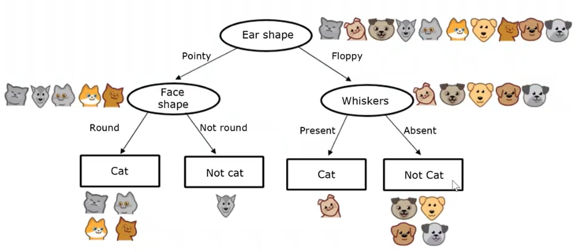
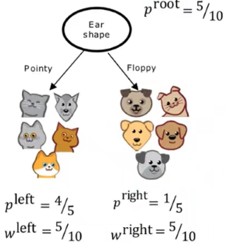

# Bababà bababà bababà

## Decision trees

Every node is a feature:

## Decision tree learning

### How to choose which feature to split at each node?

maximize purity, choose feature with highest information gain:

$$
H(p_{root})-\left(w_{left}H(p_{left})+w_{right}H(p_{right})\right)
$$

$$
H(P)=\sum_{i=0}^kp_i\cdot \log_2\frac 1{p_i}\\[1em]

H(p)=-p\log_2(p)-(1-p)\log_2(1-p)
$$

<!--  -->

Non-binary features: split each class in a standalone binary feature.

Continuous features: find the treshold with maximal information gain. The training dataset is finite, thus potential tresholds are finite too.

### Regression with decision trees

Decision trees can be used to estimate a continous (non categorical) feature. Instead of the information gain we use the variance gain:

$$
VAR(p_{root})-\left(w_{left}VAR(p_{left})+w_{right}VAR(p_{right})\right)
$$

Similar values are clustered together.

### When to stop splitting?

* when a node is 100% one class
* when splitting a node will result in exceeding a maximum depth
* when improvements in purity score are below a threshold
* when number of examples in a node is below a threshold

## Prompt engineering:

Tactics:

1. clear and specific instructions (delimiters)
2. ask the model to check/enforce prompt conditions
3. few-shot prompting (examples)

## Le 7 meraviglie degli LLM

1. classification
2. search
3. clustering
4. generation
5. summarize
6. extraction
7. rewriting
