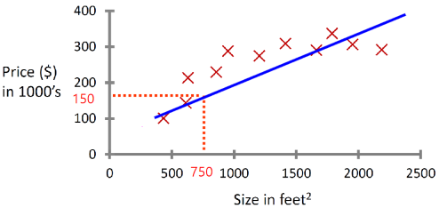
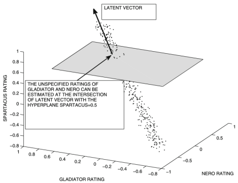
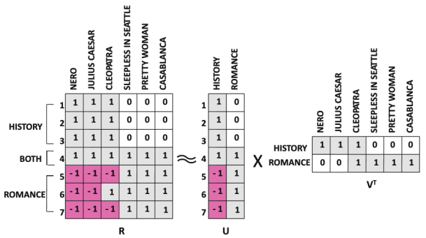

# Recommendation Systems

## Linear regression

Choose $\theta$ so that $h_\theta(x)$ is close to $y$ for our $n$ training examples $x$, $y$:

$$
\theta=\begin{pmatrix}
           \theta_1\\
           \theta_2\\
           \vdots\\
           \theta_n
        \end{pmatrix}
\quad
x=\begin{pmatrix}
        1\\
        x_1\\
        \vdots\\
        x_n
    \end{pmatrix}\\[1em]

y\cong\ h_\theta(x)=\theta^Tx\\[2em]
$$

| $i=$ 5                   | $j=$ 4 | 1 - Alice $y_{i,1}$ | 2 - Bob $y_{i,2}$ | 3 - Carol $y_{i,3}$ | 4 - Dave $y_{i,4}$ | $n=$ 2 | 1 - romance $x_1$ | 2 - action $x_2$ |
| ------------------------ | -----: | :--------------------: | :------------------: | :--------------------: | :-------------------: | ----: | :------------------: | :-----------------: |
| 1 - Love at last         |        |           5            |          5           |           0            |           0           |       |         0.9          |         0.0         |
| 2 - Romance forever      |        |           5            |          ?           |           ?            |           0           |       |         1.0          |        0.01         |
| 3 - Cute puppies of love |        |           ?            |          4           |           0            |           ?           |       |         0.99         |         0.0         |
| 4 - Non stop car chases  |        |           0            |          0           |           5            |           4           |       |         0.1          |         1.0         |
| 5 - Swords. vs. Karate   |        |           0            |          0           |           5            |           ?           |       |         0 0          |         0.9         |

* $r(j)\in[1\dots i]$ movies rated by the user $j$
* $y_{i,j}=$ rating given by user $j$ to movie $i$ (defined only if $i\in r(j)$)
* $\theta_j=$ parameter vector for user $j$
* $x_i=$ feature vector for movie $i$

For each user $j$, the rating prediction function $h_{\theta_j}(x)$ can be computed with:

$$
\min_{\theta_j}\ J(\theta_j)=\frac1{2|r(j)|}\sum_{i\in r(j)}\left(y_{i,j}-(\theta_j)^Tx_i\right)^2
$$

Where $J(\theta_j)$ is called cost function.

To learn $\theta_1,\theta_2,\dots,\theta_n$:

$$
\min_{\theta_j}\ J(\theta_j)=\frac12\sum_{j=1}^n\ \frac1{|r(j)|}\sum_{i\in r(j)}\left(y_{i,j}-(\theta_j)^Tx_i\right)^2
$$

Because the cost values are always positive, they can be aggregated by adding them together. This way, we learn all the $\theta_j$ minimizing only one cost.

### Collaborative filtering

Given $\theta_1,\theta_2,\dots,\theta_j$ and ratings $y_{i1},\dots,y_{ij}$ for the movie $i$, we can solve the resulting system for the feature vector $x_i$:

$$
(\theta_1)^Tx\cong y_{i1}\\
(\theta_2)^Tx\cong y_{i2}\\
\vdots\\
(\theta_j)^Tx\cong y_{ij}
$$

So:

* for every movie $i$, given $\theta$ and $y_{i}$, we can estimate $x_i$
* for every user $j$, given $x$ and $y_{j}$, we can estimate $\theta_j$

Starting from a rough estimate of $\theta_j$ (even random), we can repeat this process until it converges to an acceptable estimate:

$$
Guess~\theta\rightarrow x\rightarrow\theta'\rightarrow x'\rightarrow...
$$

## Latent factor models

Latent factor models try to exploit inherent correlations between the matrix values to estimate unknown values:

### Geometric intuition

The linear regression method calculates a linear combination $\theta$ of the inputs $x$. If we fix a subset of inputs $x'$, we can infer the rest of the inputs provided that the intersection between the hyperplane defined by $x'$ and the latent vector is just a point (parallelism might be problematic). Note we are in an affine space.

### Low-rank intuition

If a matrix $R$ of dimensions $m\times n$ has rank lesser than some chosen $k<\min\{m,n\}$, we can decompose it as the product of two matrices $U$ and $V^T$ of dimensions respectively $m\times k$ and $k\times n$. Alternatively, if $R$ has rank higher than $k$, it cannnot be decomposed, but can still be approximated.

$$
R\approx UV^T
$$

As an example, we have a user$\times$movie rating matrix:

$$
\begin{pmatrix}
1&1&1&0&0&0\\
1&1&1&0&0&0\\
1&1&1&0&0&0\\
1&1&1&1&1&1\\
-1&-1&-1&1&1&1\\
-1&-1&-1&1&1&1\\
-1&-1&-1&1&1&1\\
\end{pmatrix}
\approx
\begin{pmatrix}
1&0\\
1&0\\
1&0\\
1&1\\
-1&1\\
-1&1\\
-1&1\\
\end{pmatrix}
\cdot
\begin{pmatrix}
1&1&1&0&0&0\\
0&0&1&1&1&1
\end{pmatrix}
$$

From $U$ and $V$ we can approximate the values $r_{ij}$ of $R$ using the dot product.

We find the two matrices by minimizing a cost value $J$ which is computed from the residual values $R-UV^T$:

$$
\min_{U,V}\ J(U,V)=\frac12||R-UV^T||_2^2\\[1em]
=\frac12\sum_{j,i\:|\:i\in r(j)}\left(r_{ij}-\sum_{t=1}^k~u_{is}\cdot v_{js}\right)^2
$$

Which we can rewrite as:

$$
\min_{
    \begin{align*}
    \theta_1,\theta_2,\cdots,\theta_j\\
    x_1,x_2,\cdots,x_n
    \end{align*}
}\frac12\sum_{i\in r(j)}~\left(r_{ij}-\left(\theta^{j}\right)^Tx_{i}\right)^2
$$

Where $\theta_j$ is a row of $U$ and $x_i$ is a row of $V$, thus $\left(\theta^{j}\right)^Tx_{i}=\sum_{t=1}^k~u_{is}\cdot v_{js}$.

In our example, we get these residual vales:

$$
R-UV^T=
\begin{pmatrix}
0&0&0&0&0&0\\
0&0&0&0&0&0\\
0&0&0&0&0&0\\
0&0&-1&0&0&0\\
0&0&-1&0&0&0\\
0&0&1&0&0&0\\
0&0&-1&0&0&0\\
\end{pmatrix}
$$
