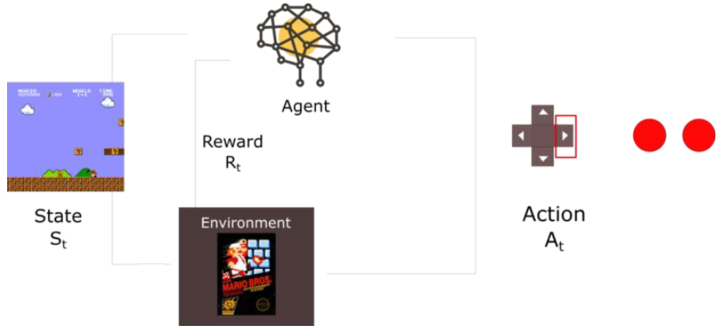
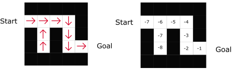
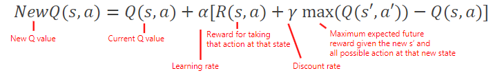

# Reinforcement Learning

Reinforcement learning is an type of machine learning where an agent learns how to behave in an environment by performing actions and seeing the results. Unlike other types of learning:

* it is active rather than passive
* interactions are often sequential: future interactions can depend on earlier ones
* we can learn without examples of optimal behaviour, instead, we optimise some reward signal

At each step $t$ the agent:

| agent                  | environment                |
| ---------------------- | -------------------------- |
| receives  $O_t$, $R_t$ | receives $A_t$             |
| executes action $A_t$  | emits $O_{t+1}$, $R_{t+1}$ |

A learning session is called a **task**:

* **episodic task**: has a starting point and a *terminal state*. An *episode* is an $S$ succession on this task.
* **continuous task**: has no terminal state, learning is performed while executing the task.

## Agent state

The agent's actions depend on its state, and the agent state is a function of the history:

$$
S_{t+1}=f(S_t,~A_t,~R_{t+1},~O_{t+1})
$$

where $f$ is a state update function.

* The agent state $S$ is supposed to be smaller than the environment. Examples of agent states:
  
  * last observation (might not be enough)
  * complete history (might be too large)

* The set of all prossible actions $A$ in the environment is called the **action space**:

  * discrete: finite number of possible actions (videogame)
  * continuous: infinite possible actions (real world)

* A reward $R$ is a scalar feedback signal at each step $t$. The agent's objective is to maximize the aggregation of all rewards:

  $$
  R(S_0)=R_1+R_2+\dots
  $$

  $$
  R(S_0)=\sum_{k=0}^\infty\gamma^kR_{1+k}
  $$

  Where:
  
  $$
  S_{t+1}=f(S_t,~A_t,~R_{t+1},~O_{t+1})
  $$
  
  $k$ is an action counter, and $\gamma\in[0,1[$. With small $\gamma$, the agent cares more about the short-term reward. Otherwise, the learning agent cares about all possible rewards.

  * **exploration** (big $\gamma$): trying to find more information about the environment
  * **exploitation** (small $\gamma$): prioritizing known information

* An observation $O$ is a snapshot of the environment state:

  * **full observability**: a complete description of the state of the world, fully observed environment
  * **partial observability**: partial description of the state of the world, hidden information

### The Policy

The policy $\pi$ is the function that tells the agent which action to take given a state. The learning goal is to find the optimal policy $\pi'$ that maximizes expected reward. It's the projection of $A_{t+1}$ on the result of state update function $f$:

$$
\pi(S)=\pi^4_2(f(S))\\
A_{t+1}=\pi(S_t)
$$

In reinforcement learning, we find $\pi'$ through training. We can identify two approaches:

* **policy based**:
  * *deterministic*: returns a single action to take
  * *stochastic*: returns a probability distribution of possible actions to take
* **value based**:\
  the agent takes the action with the highest estimated cumulative reward:

  $$
  \max R_{EST}(S)
  $$

## Q-Learning

The action value function (or Q-Function) $NewQ$ takes a state $S$ and an action $A$ and it returns the expected future reward of that action at that state.

$$
NewQ(S,A)=(1-\alpha)Q(S,A)\ +\ \alpha\Bigl(R(S,A)+\gamma\max_{A'}\left(\,Q(S',A')\,\right)\Bigr)
$$

Where:

* $Q(S,A)$ is the current estimated cumulative gain for taking the action $A$ from state $S$
* $S',A'$ are the new state entered when taking the action $A$ from state $S$ and one action taken from the new state
* $\alpha$ is the learning rate: how quickly a network abandons the former value for the new. If the learning rate is 1, the new estimate will be the new Q-value.
new Q-value

## Deep Q-Learning

lorem ipsum
