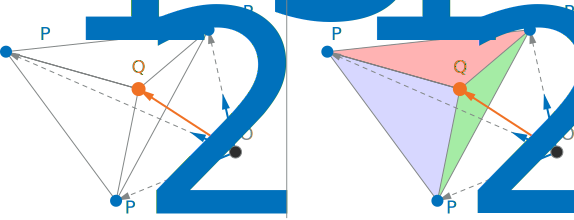

# Algebra

## Affine Spaces

An affine space is a triple $\lang A,V,+\rang$ where $A$ is a set (of points), $V$ is a vector space, and $+:A\times V\rightarrow A$ is a function satisfying the following conditions:

1. $P+0=P\quad\forall P\in A$,$\quad0\in V$
2. $(P+u)+v=P+(u+v)$,$\quad\forall P\in A$,$\quad\forall u,v\in V$
3. $\forall P,Q\in A$,$\quad \exists u:P+u=Q$

The unique vector $u:P+u=Q$ is denoted by $\overrightarrow{PQ}$ or $Q-P$. We have then $P+\overrightarrow{PQ}=P+(Q-P)=Q$.

Addition of points does not exist.

### Affine Subspace

The affine subspaces $\lang S,W,+\rang$ of $A$ are the subsets in the form $S=P+W=\{P+w\mid w\in W\}\subseteq A$, where $P$ is a fixed point of $A$ and $W$ is a subspace of $V$. This represents all the points $P$ can be translated to via $W$, thus the dimension of $S$ is $\mathrm{dim}(W)$.

### Affine Independence

The points $P_0,\ldots,P_k$ of an affine space are affinely independent if and only if, the vectors $\overrightarrow{P_0P_1},\ldots,\overrightarrow{P_0P_k}$ are linearly independent $\forall P_0\in A$.Equivalently, $k$ points in an affine space are affinely independent iff the smallest affine subspace containing them has dimension $k-1$.

* two points are affinely independent if and only if they are distinct
* three points are affinely independent if and only if they are not collinear
* four points are affinely independent if and only if they are not coplanar

### Affine combination, Convex combination

Given two points $P_1$ and $P_2$ and a third origin point $O$.

The affine combination of $P_1$ and $P_2$ is defined as $P=\alpha(P_1-O)+(1-\alpha)(P_2-O)+O$.\
Since the sum of the coefficients equals $1$, the resulting point is restricted to the line across $P_1$ and $P_2$, independently of $O$.

$$
P=\alpha(P_1-O)+(1-\alpha)(P_2-O)+O=\alpha P_1-\alpha O+(1-\alpha)P_2-(1-\alpha)O+O=\alpha P_1+(1-\alpha)P_2
$$

(a sum of points is a stretch of notation) The concept can be extended to $n$ points:

* The affine combinations of 2 independent points describe the line containing them
* The affine combinations of 3 independent points describe the plane containing them

Convex combinations of $n$ points $\alpha_n(P_n-P_0)$ are affine when $\alpha_n\geq0$:

* The convex combinations of 2 independent points describe the segment joining them
* The convex combinations of 3 independent points describe the triangle that has the points as vertices

## Linear and Affine transformation

### Linear transformation

Let $V$ be a vector space over the field $K$. A transformation (mapping) $f:V\rightarrow V$ is linear iff it preserves linear combination:

* $f(\alpha x)=\alpha f(x)$,$\quad\forall\alpha\in K, x\in V$
* $f(x+y)=f(x)+f(y)$,$\quad\forall x,y\in V$

A linear transformation is orientation-preserving iff it preserves the direction of angles (clockwise/counterclockwise).

A linear transformation is rigid iff it preserves the dot product $x\cdot y=f(x)\cdot f(y)$, that is, if it preserves the angles and the norms.

The linear transformation represented by matrix $M$ is rigid iff $M^{-1}=M^\mathsf T$. Such matrices are called orthogonal.

Every linear, rigid, orientation-preserving transformation is a rotation and viceversa.

### Affine transformation

Let $\lang A,V,+\rang$ be an affine space. A transformation is affine iff it preserves affine combination (of points).

Every affine map is determined by the image of any point plus a linear map. For any affine map $f:A\rightarrow A$ there is a point $P_0$ and a unique linear map $h:V\rightarrow V$ so that:

$$
f(P)=f(P_0+v)=f(P_0)+h(v)=f(P_0)+h(P-P_0)\\
\forall P\in A
$$

In general:

$$
f(P)-P_0=(f(P_0)-P_0)+P-P_0\\
f(x)=Hx+t
$$

Affine maps for which $h$ is the identity are called translations: $f(P)=P+(f(P_0)-P_0)$.

Every rigid, orientation-preserving transformation of $\mathbb R^n$ is affine and can be uniquely expressed as the composition of a translation and a rotation. Translations are rigid.

$$
f(x)=Rx+t
$$

Note that $RR^\mathsf T=I$.

---

## Homogeneous Coordinates

Homogeneous coordinates have the property that the tuples $(x_1,x_2,…,1)$  and $(αx_1,αx_2,\ldots,α)$ represent the same point (for $α\neq0$). Thus, unlike cartesian coordinates, a single point can be represented by infinitely many homogeneous coordinates.

By using homogeneous coordinates, we move from the euclidean space $\mathbb R^{n+1}$ to the projective space $\mathbb P^n(\mathbb R)$ by identifying points in $\mathbb R^{n+1}$ that lie on the same line through the origin (minus the origin itself) with each other. All of the points that have the same projection are an equivalence class corresponding to a single point in the projective space.

### Affine transformations in homogeneous coordinates

We can use homogeneous coordinates to both implement affine transformations and mark the distinction between points and vectors. We add a $n+1$ component to $A^n$, which will be $1$ for points and $0$ for vectors. This brings various benefits:

* point $+$ vector $=$ point
* point $-$ point $=$ vector
* $\alpha P+\beta Q=$ point
* affine tranformations encoding

If we divide each point $(αx_1,αx_2,\ldots,α)$ by its respective $\alpha$, they get *projected* on what can be seen as an affine subspace of $\mathbb R^n$ with $x_{n+1}=1$. From the point of view of $\mathbb P^n(\mathbb R)$, nothing has changed.

Affine transformations of points $f(P)=h(P-P_0)+f(P_0)$ and vectors $f(x)=Hx+t$ become respectively:

$$
\begin{pmatrix}
y\\
1
\end{pmatrix}
=
\begin{pmatrix}
H & t\\
0 & 1
\end{pmatrix}
\begin{pmatrix}
x\\
1
\end{pmatrix}\\
\begin{pmatrix}
y\\
0
\end{pmatrix}
=
\begin{pmatrix}
H & t\\
0 & 1
\end{pmatrix}
\begin{pmatrix}
x\\
0
\end{pmatrix}
$$

Note that vectors are unaffected by translation. In the case of rigid transformations, $H$ will be a rotation matrix $R$.

Affine transformations form a group:

$$
\begin{pmatrix}
A & t\\
0 & 1
\end{pmatrix}
\begin{pmatrix}
B & u\\
0 & 1
\end{pmatrix}
=
\begin{pmatrix}
AB & Au+t\\
0 & 1
\end{pmatrix}
$$

An affine map of $\mathbb{R}^n$ becomes a linear map of $\mathbb{R}^{n+1}$.

### From points to objects

To transform an object (a mesh), we apply the same transformations to each of its vertices. Rigid linear transformations, which preserve shape and size, are called *rigid body*.

---

## Barycentric coordinates

In a barycentric coordinate system, the location of a point is specified by reference to a simplex (a triangle for points in a plane).

Let $P_1,\ldots,P_n$ be $n$ affinely independent points in a affine space $A$ of dimension $n$ (the points define a simplex). Given any point $Q\in A$, there are scalars $\alpha_1,\ldots, \alpha_n$ that are not all zero, such that:

$$
(\alpha_1+\cdots+\alpha_n)\overrightarrow{OQ}=\alpha_1\overrightarrow{OP_1}+\cdots+\alpha_n\overrightarrow{OP_n}\qquad\forall O\in A
$$

The elements of a $n$ tuple $(\alpha_1:\ldots:\alpha_n)$ that satisfies this equation are called barycentric coordinates of $Q$ with respect to $P_1,\ldots,P_n$.

The use of colons means that barycentric coordinates are a sort of homogeneous coordinates, the point is not changed if all coordinates are multiplied by the same nonzero constant because everything gets scaled around $O$ by the same amount. Equivalently, two coordinates refer to the same point iff they are multiples of eachother, as there's only one tuple $(\alpha_1:\ldots:\alpha_n)$ that satisfies the above equation for a given $Q$.

For example, let's consider $n=3$ and $(\alpha_1+\alpha_2+\alpha_3)=1$. In this case, $\alpha_1\overrightarrow{OP_1}+\alpha_2\overrightarrow{OP_2}+\alpha_3\overrightarrow{OP_3}$ is an affine combination.\
We now define an alternative representation $(0,\beta_1,\beta_2)$ for a point with non-zero barycentric coordinates $Q$, such way that the tuples are not multiple of eachother. These coordinates do not satisfy the equation $\overrightarrow{OQ}=0+\beta_2\overrightarrow{OP_2}+\beta_3\overrightarrow{OP_3}$, because $Q$, having non-zero barycentric coordinates, lies outside the line defined by the affine combination of the vertices $P_2$ and $P_3$.\
We chose $0$ as the first coordinate to guarantee it to not be a multiple of the solution $(\alpha_1:\alpha_2:\alpha_3)$, but it holds true for all non-multiples. Also note that $(\alpha_1+\alpha_2+\alpha_3)=k$, is just an uniform scaling of factor $k$.

The coordinates are all positive iff $Q$ lies inside the simplex.

Moreover, the barycentric coordinates are also not changed if the origin point $O$ is changed:

$$
(\alpha_1+\cdots+\alpha_n)\overrightarrow{O'Q'}=\alpha_1\overrightarrow{O'P_1}+\cdots+\alpha_n\overrightarrow{O'P_n}\;\implies\\[6pt]
(\alpha_1+\cdots+\alpha_n)(\overrightarrow{O'Q'}-\overrightarrow{OQ})=\alpha_1(\overrightarrow{O'P_1}-\overrightarrow{OP_1})+\cdots+\alpha_n(\overrightarrow{O'P_n}-\overrightarrow{O'P_n})\\
=(\alpha_1+\cdots+\alpha_n)\overrightarrow{O'O}\;\implies\\[6pt]
\overrightarrow{O'Q'}=\overrightarrow{O'O}+\overrightarrow{OQ}=\overrightarrow{O'Q},\quad Q'=Q
$$

Intuitively, the influence (in blue) of each $\overrightarrow{OP_i}$ vector is proportional to its length.\
The homogeneous barycentric coordinates of $P_i$ are all zero, except the one of index $i$.

### Normalized barycentric coordinates

In our context it is useful to constrain the barycentric coordinates of a point so that they are unique. This is achieved by imposing the condition $\sum \alpha_i=1$, or equivalently by dividing every $\alpha_i$ by the sum of all $\alpha_i$. These specific barycentric coordinates are called *normalized*.
In our case, normalized barycentric coordinates are called barycentric coordinates. The above defined coordinates are called "homogeneous barycentric coordinates".

The convex combination of $P_1,\ldots,P_n$ (all the points with nonnegative barycentric coordinates) describe a convex hull that is the simplex with these points as its vertices.

For $n=3$, normalized barycentric coordinates measure the signed areas of the subtriangles around $Q$.

---

## Adjugate (adjoint) matrix

We can compute the cofactors of a square matrix $A$ using Cramer's rule:

$$
C=
\begin{pmatrix}
C_{11} & C_{12} & \cdots & C_{1n}\\
C_{21} & C_{22} & \cdots & C_{2n}\\
\vdots & \vdots & \ddots & \vdots\\
C_{n1} & C_{n2} & \cdots & C_{nn}
\end{pmatrix}
$$

The transpose $C^\mathsf T$ of the cofactor matrix is called the *adjugate matrix* (also called the adjoint) of $A$.

The product of a square matrix $A$ with its adjugate gives a diagonal matrix whose diagonal entries are $\det(A)$:

$$
AC^\mathsf T=\det(A)I
$$

If $A$ is invertible, its inverse is $C^\mathsf T$ times the reciprocal of the determinant of $A$:

$$
\begin{aligned}
C^\mathsf T & =\det(A) A^{-1}\\
\frac1{\det(A)}C^\mathsf T & =A^{-1}
\end{aligned}
$$

Note that the adjugated matrix is still computable if $\det(A)=0$.
