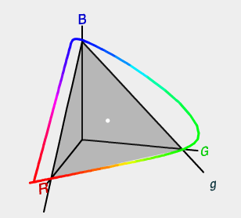
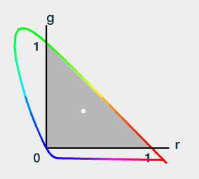

# Light and Color

## Radiometry basics

Radiometry deals with the measurement of electromagnetic radiation measured in Joules ($J$).

### Radiant flux $\Phi$

$$
\Phi=\frac{d Q}{d t}
$$

Radiant flux is the flow of radiant energy ($Q$) over time (power) measured in watts ($W$).

### Surface Reflectance $R$

Reflectance is the ratio of energy reflected to the total energy incident on a surface, More precisely, it is the ratio of radiant flux. The reflectance of a surface describes how the surface interacts with light, and can also depend on lighting and viewing directions

### Irradiance $E$

$$
E=\frac{\partial\Phi}{\partial A}
$$

Power is typically measured over an area: since we are interested in points, we divide power by area and obtain irradiance, which is the power arriving at a surface ($W/m^2$). It measures light from all incoming directions.

Irradiance is also called *radiosity* when it leaves the surface.

### Radiance $L$

$$
L=\frac{\partial^2\Phi}{\partial A\partial\Omega}
$$

Radiance is a measure of electromagnetic radiation in a *single ray*, it is obtained by dividing by steradian (the measurement unit of solid angles). It is defined as the density of radiant flux with respect to both area and solid angle measured in $W/(m^2 st)$.

### Steradians $\Omega$

A direction is apoint in the unit sphere. A set of directions form a region on the unit sphere called solid angle, measured in steradians ($sr$), where $1sr=1rad^2$. Given that the area of a sphere is $4\pi r^2$, the solid angle of the whole unit sphere is $4\pi sr$.

### Spectral Radiance

Most light waves contain a mixture of many different wavelengths (visualised as a *spectral power distribution*), so all radiometric quantities have spectral distributions as densities over wavelength. We don't need to use the full SPD in rendering, three values are enough, because what we ultimately want is color.

### Light Field

The radiance in an environment can be thought of as a function of five variables (or six, including wavelength), called the radiance distribution: three of the variables specify a location, the other two a direction (azimuth and elevation angles). This function describes all light traveling anywhere in space.

The purpose of evaluating a shading equation is to compute the radiance along a given ray, from the shaded surface point $X$ to the camera. We ignore any effect of light absorption because of travel, thus the amount of light must be conserved along a ray. This means we need only to consider points at surfaces, where light can change direction, and given a ray $v$ between two points $X$ and $C$ we have $L(X,v)=L(C,-v)$.

---

## Colorimetry

Colorimetry deals with the relationship between spectral power distributions and the perception of color.

Wavelengths between 380nm and 750nm are perceived by the human eye as color. Cones in the eye respond differently to one of only three different wavelengths. This is why just three values can be used to precisely represent any color stimulus.

### Color Matching

We choose three wavelengths (615nm, 525nm, 445nm) as primaries, then for any single-wavelength light, we tune the primaries intensity so that the result appears the same to human beings.

Negative intensities in the CMF means that some colors are not reproducible by simply adding the three primaries together.

For an arbitrary color, the color-matching functions can be multiplied by the spectral distribution, and the area under each resulting curve (the integral) gives the relative amounts to set the colored lights to match the perceived color produced by the spectrum.

Considerably different spectral distributions can look the same to an observer, and will resolve to the same three weights, they (metamerism).

### Chromaticity Diagram

Another way to visualize the data is to plot it in threedimensional space:

Considering only hue and saturation (ignoring intensity), we can project the curve to the plane r+g+b=1.

Since we have the constraint r+g+b=1, working in 3D space is kind of unnecessarily complex because we can always reconstruct the original signal in 2D space by utilizing the constraint. That said, we can project this curve on RG plane without caring about B, which usually matches intensity.

The triangle represents the gamut of a typical television or computer monitor. The three corners of the triangle are the primaries, which are the most saturated red, green and blue colors the screen can display.

### RGB Color Spaces

Each color spaced is defined by:

* A mapping (usually, a 3x3 matrix) between CIE and a color in the space. The mapping is defined by a choice of primaries in the chromaticity diagram (basis), and a choice of white point (the scale, a point in the chromaticity diagram representing white, i.e. R=1,G=1,B=1).
* A gamma transfer function.

### Gamma Encoding

Rendering calculations are performed in a linear color space, but our eyes' brightness perception is not linear.\
Colour data is usually stored as 3 8-bit integers per pixel. With 8 bits, 256 distinct intensity levels can be represented, and if the spacing of these levels were physically linear, we would be losing a lot of precision on dark shades while being unnecessarily precise on light shades.

The solution is to let the 256 distinct levels represent intensity values on a perceptually linear scale (but consequently non-linear in terms of radiance). The transformation of the physically linear intensity data (generated via an algorithm or captured by a linear device) to discrete values of the perceptually linear scale is called *gamma encoding*.

The relationship between perceptually linear ($B$) and physically linear ($V$) values follow the power law: $B=V^\gamma$. $\gamma=0.45$ for sRGB.

We need to write gamma-encoded color values into the frame buffer for the image to display correctly. This means that if we need to do image processing, or computations with colors, we need to account that.

### Gamma Correction

Monitor response is non linear and has to be corrected. The process of nullifying the display's response curve is called gamma correction. Gamma correction is a separate step that compensates for monitor's own display characteristics.
