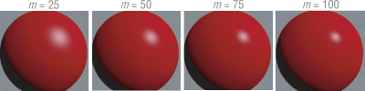
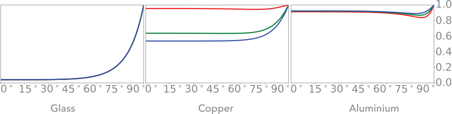
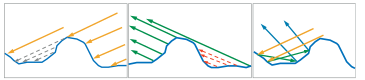
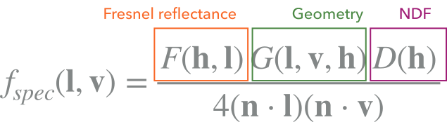
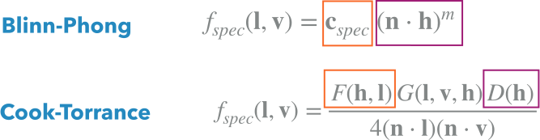

# Shading Models

## Blinn-Phong (specular)

$$
f_\text{spec}(l,v)=(n\cdot h)^m
$$

This is a non physical model. Increasing $m$ causes the specular highlights to be smaller and brighter.

### Phong (old formulation)

An alternative formulation of the Phong specular term is $f_\text{spec}(l,v)=(r_i\cdot v)^m$. This requires the reflection vector $r_i$ to be computed with the method above. This approach has two main disadvantages:

1. Phong will be slower than Blinn-Phong when the viewer and light are approaching infinity. In this case, the direction to the viewer's position $v$ and the direction to the light's position $l$ can be considered constant, so $h$ can be calculated once. The same is not true when using the reflection vector $r_i$, which depends on the surface curvature and must be recalculated for each point.
2. The left image shows Phong reflections with the angle $\theta_r<$ 90°. In the right image $\theta_r>$ 90°, and the specular contribution is clamped as $r_i\cdot v<0$. This can be an issue if $m$ is small and the resulting specular radius would be large enough to have a contribution under these conditions.\

## Physically Based Rendering (PBR)

In physically-based rendering, we use BRDFs based on physics principles and laws (conservation of energy, etc), and inputs in correct physics units to achieve more consistent and realistic results in varying lighting conditions.

### Assumptions on the BRDF

1. The BRDF is only defined for light and view directions above the surface, i.e., $(n\cdot l)$ and $(n\cdot v)$ must both be nonnegative (assume clamping from now on).
2. A BRDF must posses reciprocity: $f(l,v)=f(v,l)$
3. The value of $R(l)$ must always be between 0 and 1, as a result of energy conservation:
   $$
   0\leq\quad R(l)=\int_{v\in\Omega}f(l,v)(n\cdot l)\thickspace\mathrm dv\quad\leq 1
   $$
   Note that this restriction does not apply to the values of the BRDF. As a distribution function, the BRDF can have arbitrarily high values in certain directions (such as the center of a highlight) if the distribution it describes is highly non-uniform.

## Lambertian (diffuse)

Lambertian BRDFs are often used in real-time rendering to model the diffuse term (the result of local subsurface scattering), where incoming light is equally reflected in all directions. They are a simple constant, and the change in the shading is handled by the cosine term of the reflectance equation $(n\cdot l)$.

$$
f_{\text{diff}}(l,v)=\frac{c_{\text{diff}}}\pi
$$

The constant reflectance value $c_{\text{diff}}$ is the fraction of irradiance that is absorbed and then reflected in the three bands RGB. In a Lambertian BRDF, it is called diffuse color or *albedo* of the material.\
$c_{\text{diff}}$ must be black for metals as they have no subsurface scattering.

$\pi$ is required for energy conservation.

## Physically-based specular term

### Fresnel

The amount of light reflected by a substance (as a fraction of incoming light) is described by the Fresnel reflectance $\mathrm F(\theta_i)$, which depends on the incoming angle $\theta_i$ between $n$ and $l$. In principle, its value varies continuously over the visible spectrum, for rendering purposes its value is treated as an RGB vector.

The function $\mathrm F(\theta_i)$ has the following characteristics:

* Reflectance is almost constant for incoming angles between 0° and about 45°.\
When $\theta_i=0\degree$ ($l=n$) is called *normal incidence*.
* The reflectance changes more significantly between 45° and about 75°.
* Between 75° and 90° reflectance always goes rapidly to 1 (white, if viewed as an RGB triple).

Since the Fresnel reflectance stays close to $\mathrm F(0)$ over most of the range, we can think of this value as the characteristic specular reflectance of the material. This value has all the properties of what is typically thought of as a "color"; it is composed of RGB values between 0 and 1, and it is a measure of selective reflectance of light.\
For this reason, we will also refer to this value as the *specular color* of the surface, denoted as $c_\mathrm{spec}$.

#### Schlick approximation

A good approximation of the curves in the previous slide has been provided by Schlick:

$$
\mathrm F_\mathrm{Schlick}(n,l,\mathrm F_0)=\mathrm F_0+(1-\mathrm F_0)(1-(n\cdot l))^5
$$

When using the Schlick approximation, $\mathrm F_0$ is the only parameter that controls Fresnel reflectance. Reference values for $\mathrm F_0$ are available for many real-world materials.

### Microfacet Theory

The basic assumption underlying microfacet theory is that the surface is composed of many optically-flat *microfacets*, too small to be seen individually. An optically flat surface splits light into exactly two directions: reflection and refraction. The usual choice is for each microfacet to be a perfect Fresnel mirror, resulting in a model for surface reflection.

When examining reflection of light from a given light vector $l$ into a given view vector $v$, only the microfacets which have their surface normal $n$ aligned with the half vector $h$, participate in the reflection of light (we call them "active").\
Reflected light depends only on the "amount" of active microfacets (in red).

Not all active microfacets will contribute: some will be blocked by other microfacets from the lighting direction (shadowing) or from the view direction (masking). Inter reflections are also possible but not typically taken into account in today's models.

### Microfacet specular BRDF

Also called general Cook-Torrance microfacet specular model, where:

* $F(h,l)$ is the Fresnel reflectance of the active microfacets (the ones where $n=h$).
* $G(l,v,h)$ is the geometry function: the probability that microfacets with $n=h$ will be visible from both the light direction $l$ and the view direction $v$.
* $D(h)$ is the Normal Distribution Function (NDF), that is the concentration of active micro-facets.

The denominator consists of correction factors.

#### The NDF

The NDF has a significant effect on the appearance of the rendered surface: it determines the width and shape of the cone of reflected rays (the specular lobe), which in turn determines the size and shape of specular highlights.\
The NDF affects the overall perception of surface roughness, as well as more subtle visual aspects such as whether highlights have a distinct edge or are surrounded by haze. Usually, a parameter $\alpha$ is exposed controlling how much a material is rough: 0 for a perfectly smooth material, 1 for very rough materials:

### Making Phong psysically plausible

$$
\begin{aligned}
& f_\mathrm{spec}(l,v)=\frac{F(h,l)(n\cdot l)(n\cdot v)D(h)}{4(n\cdot l)(n\cdot v)} & \left[G=(n\cdot l)(n\cdot v)\right]\\
& =\frac{F(h,l)}{4}\cdot\frac{m+2}{2\pi}(n\cdot h)^m=\frac{m+2}{8\pi}F(h,l)(n\cdot h)^m & \left[D(h)=\frac{m+2}{2\pi}(n\cdot h)^m\right]\\
& =\frac{m+2}{8\pi}F_\mathrm{Schlick}(h,l,c_\mathrm{spec})(n\cdot h)^m & \left[\mathrm F_0=c_\mathrm{spec}\right]
\end{aligned}
$$

The normalization factor $\frac{m+2}{8\pi}$ makes the BRDF energy preserving by keeping the total reflectance $R$ constant.\
Intuitively, when $m$ increases (corresponding to a smoother surface), the size of the highlight decreases, but its brightness increases.

### Combining diffuse and specular

Simply adding $f_{\text{spec}}(l,v)+f_{\text{diff}}(l,v)$ can violate energy conservation for certain inputs, where in reality subsurface reflection can only utilize incoming energy which was not reflected back at the surface. One simple approach is to multiply the diffuse term by $(1 − F(h, l))$.

## Metalness workflow

We can redefine the inputs to the model by observing that for metals $c_\mathrm {diff}$ is not needed (is black), and for dielectrics, a specular monochromatic value of 0.04 can be used for $c_\mathrm{spec}$. By introducing a float parameter called *metalness*, we can use just one color (*base color*):

* when metalness is 0: $c_\mathrm {diff}=$ base color, $c_\mathrm{spec}=\langle0.04, \ldots\rangle$
* when metalness is 1: $c_\mathrm {diff}=\langle0, \ldots\rangle$, $c_\mathrm{spec}=$ base color
