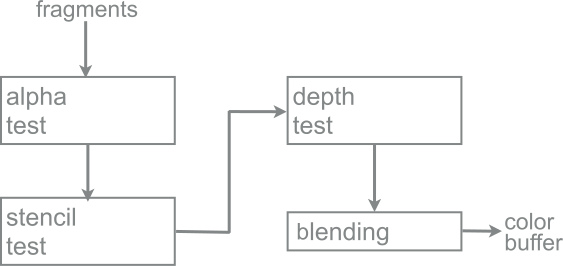
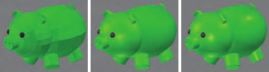

# Pipeline

## Pipeline

* The vertex shader is a fully programmable stage that is used to
implement the vertex processing stages.
* The tessellation stage and geometry shader are both optional, and not all GPUs support them, especially on mobile devices. They are part of vertex processing.
  * The tessellation stage can be used to adapt the LOD of the mesh.
  * The geometry shader can be used to perform per-primitive (lines, triangles) shading operations, to destroy primitives, or to create new ones.
* The clipping, triangle setup, and triangle traversal stages are implemented by fixed-function hardware.
* The screen mapping stage is affected by window and viewport settings.
* The pixel shader stage is fully programmable.
* The merger stage is not programmable but it is highly configurable and can be set to perform a wide variety of operations.

## Pixel processing

### Pixel shading

The pixel shader receives fragments from the rasteriser, and computes and outputs their color. It can also possibly produce an opacity value and optionally modify its z-depth. Fragment shader would be perhaps a better name, because it is run per-fragment.

### Merging

The merging stage is where the depths and colors of the individual fragments (generated by the pixel shader) are combined with the frame-buffer. On most pipelines this stage is where stencil-buffer and z-buffer operations occur. If the fragment is visible, another operation that takes place in this stage is color blending, commonly used for transparency and compositing operations.

### Buffers

* frame buffer
  * color buffer: where the information for each pixel is stored (front/back buffers).
  * alpha channel: associated with the color buffer, stores a related opacity value for each pixel.
  * z-buffer: for each pixel it stores the z-value from the camera to the currently closest primitive.
* stencil buffer: is an offscreen buffer used to record the locations of the rendered primitive.
* accumulation buffer: images can be accumulated using a set of operators.

### Depth test

When a fragment arrives, with coordinates $(i,j)$, the z-test reads the value stored in the depth buffer at $(i,j)$, and compares it to the current fragment $z$ value. If the comparison is not satisfied, the fragment is discarded.

## Shading

The shading equations can be evaluated at different stages of the pipeline.

### Flat shading

Evaluation per primitive (by geometry shader, if any). Results are constant over the primitive. This is usually undesirable, since it results in a faceted look, rather than the desired smooth appearance

### Per-vertex (Gouraud)

Evaluation per vertex (by the vertex shader) and then linearly interpolated. The vertex shader uses the world-space vertex normal and position to evaluate the shading, and then interpolates the output. The pixel shader takes the interpolated values and directly writes them to the output.

### Per-pixel (Phong shading)

Evaluation per pixel (by the pixel shader). The vertex shader writes the worldspace normals and positions to interpolated values. The pixel shader uses these interpolated values to evaluate the shading model.

