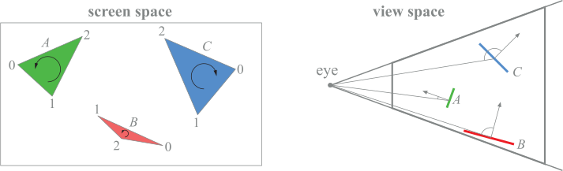

# Rasterization

## Triangle Setup

The purpose of this stage is to compute factors that are constant over the triangle so that traversal can proceed efficiently.

### Backface culling

This test can be implemented by computing the signed area $S$ of the triangle in two-dimensional screen space. A negative signed area means that the triangle is facing backwards and should be culled.

If vertex $A$ is located at the origin of a Cartesian coordinate system and the coordinates of the other two vertices are $B=(x_B,y_B)$ and $C=(x_C,y_C)$, then the area can be computed as $1/2$ times the determinant:

$$
S=\frac12\det\begin{pmatrix}x_B & x_C \\ y_B & y_C\end{pmatrix}=\frac12(x_B y_C-x_C y_B)
$$

$$
S=\frac12\det\begin{pmatrix}x_B-x_A & x_C-x_A \\ y_B-y_A & y_C-y_A\end{pmatrix}=\frac12\left((x_B-x_A)(y_C-y_A)-(x_C-x_A)(y_B-y_A)\right)
$$

If $\overrightarrow{AC}$ is on the left of $\overrightarrow{AB}$ the area is positive, otherwise it's negative. This is is equivalent to calculating $\overrightarrow{AB}\times\overrightarrow{AC}$.\
The expressions can be tweaked for alternative vertex traversals, for example using $\overrightarrow{AB}$ and $\overrightarrow{BC}$.

## Triangle Traversal

The purpose of this stage is to determine which pixels (or fragments) should be used to approximate points, lines and polygons by sampling them in screen space. For polygons it's also required to determine which pixels lie inside the two-dimensional polygon determined by its vertices.

Moreover, attributes associated to vertices (color, z-value, normal, ...) are computed for each derived pixel.

### Barycentric coordinates interpolation

To solve the visibility problem, we need depth information. We have already stored the $z$-order of the camera space vertices in the screen space vertices, and now we can interpolate the depth of the points across the surface of the projected triangle.\
This interpolation is done over (normalized) barycentric coordinates. To find them for a given point $P$ and triangle $\widehat{P_1P_2P_3}$, we solve the following system of equations for $u$, $v$, and $w$:

$$
P_{x} = u X_{P1} + v X_{P2} + w X_{P3}\\
P_{y} = u Y_{P1} + v Y_{P2} + w Y_{P3}\\
u + v + w = 1
$$

### Hyperbolic interpolation

The screen position $(p_x,p_y,p_z)$ can be correctly interpolated linearly over the triangle, with no need for adjustment. However, the colors and especially texture coordinates cannot normally be linearly interpolated. The result is improper foreshortening due to the perspective effect.

Let us consider the clip space (the last before division), where $(p_1,w_1)$, $(p_2,w_2)$ are two homogeneous coordinates, and $q_1=\frac1{w_1}p_1$ and $q_2=\frac1{w_2}p_2$ are their respective in NDC. We want to linearly interpolate their values:

$$
\alpha\begin{pmatrix}p_1 \\ w_1\end{pmatrix}+\alpha\begin{pmatrix}p_2 \\ w_2\end{pmatrix}\\[5pt]
\beta q_1+(1-\beta)q_2
$$

Note that the relationship between coefficients is non linear:

$$
\beta=\frac{\alpha w_1}{\alpha w_1+\alpha w_2}
$$
