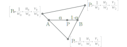

# Rasterization

## Triangle Setup

The purpose of this stage is to compute factors that are constant over the triangle so that traversal can proceed efficiently.

### Backface culling

This test can be implemented by computing the signed area $S$ of the triangle in two-dimensional screen space. A negative signed area means that the triangle is facing backwards and should be culled.

If vertex $A$ is located at the origin of a Cartesian coordinate system and the coordinates of the other two vertices are $B=(x_B,y_B)$ and $C=(x_C,y_C)$, then the area can be computed as $1/2$ times the determinant:

$$
S=\frac12\det\begin{pmatrix}x_B & x_C \\ y_B & y_C\end{pmatrix}=\frac12(x_B y_C-x_C y_B)
$$

$$
S=\frac12\det\begin{pmatrix}x_B-x_A & x_C-x_A \\ y_B-y_A & y_C-y_A\end{pmatrix}=\frac12\left((x_B-x_A)(y_C-y_A)-(x_C-x_A)(y_B-y_A)\right)
$$

If $\overrightarrow{AC}$ is on the left of $\overrightarrow{AB}$ the area is positive, otherwise it's negative. This is is equivalent to calculating $\overrightarrow{AB}\times\overrightarrow{AC}$.\
The expressions can be tweaked for alternative vertex traversals, for example using $\overrightarrow{AB}$ and $\overrightarrow{BC}$.

## Triangle Traversal

The purpose of this stage is to determine which pixels (or fragments) should be used to approximate points, lines and polygons by sampling them in screen space. For polygons it's also required to determine which pixels lie inside the two-dimensional polygon determined by its vertices.

Moreover, attributes associated to vertices (color, z-value, normal, ...) are computed for each derived pixel.

### Barycentric coordinates interpolation

To solve the visibility problem, we need depth information. We have already stored the $z$-order of the camera space vertices in the screen space vertices, and now we can interpolate the depth of the points across the surface of the triangle.\
This interpolation is done over (normalized) barycentric coordinates. To find them for a given point $P$ and triangle $\widehat{ABC}$, we solve the following system of equations for $\dot u$, $\dot v$, and $\dot w$:

$$
x_P=\dot ux_A+\dot vx_B+\dot wx_C\\
y_P=\dot uy_A+\dot vy_B+\dot wy_C\\
\dot u+\dot v+\dot w=1
$$

We'll use $\dot u$, $\dot v$, $\dot w$ to distinguish barycentric coordinates from clip space coordinates $[x,y,z,w].$

### Hyperbolic distorsion

Perspective division turns the view frustum into a cube, a non-linear operation that [bends lines](https://alexsabourindev.wordpress.com/2019/08/27/a-quest-towards-intuition-why-is-depth-interpolated-as-1-z/) spanning the $z$ axis.

Luckily, our perspective transformation matrix is purposely built to retain depth information after perspective division, and compensate distortion. The $z/w$ values get squeezed towards the far plane (losing z-buffer precision) so that they can be linearly interpolated. This correction is called *hyperbolic distorsion*.

### Interpolate a linear z-buffer (w-buffer)

Without hyperbolic distorsion, simply interpolating $z_P=\dot uz_A+\dot vz_B+\dot wz_C$ doesn't work in screen space. Once we have performed the perspective divide, then $z$ doesn't vary linearly anymore across the surface of the projected triangle. The solution is to compute the inverse of $z_P$ by interpolating the inverse of the vertices' $z$-coordinates:

$$
\frac1{z_P}=\dot u\frac1{z_A}+\dot v\frac1{z_B}+\dot w\frac1{z_C}
$$

To explain the depth interpolation issue, we can see the triangle (in 3D, camera space) lying on a plane. A point $(x,y,z)$ lies on a plane if the respective [plane equation](https://www.nagwa.com/en/explainers/373101390857/) is true:

$$
ax+by+cz+d=0
$$

Writing $x_\text{screen}$ and $y_\text{screen}$ as $\tilde x$, $\tilde y$, we know that:

$$
\tilde x_P=\frac{x_P}{z_P}\qquad \tilde y_P=\frac{y_P}{z_P}\\[1em]
x_P=\tilde x_Pz_P\qquad y_P=\tilde y_Pz_P
$$

If we substitute these two equations in the plane equation and solve for $z_P$, we get:

$$
\begin{aligned}
& a\tilde x_Pz_P+b\tilde y_Pz_P+cz_P+d=0\\[.2em]
& \implies z_P(a\tilde x_P+b\tilde y_P+c)=-d\\[.2em]
& \implies a\tilde x_P+b\tilde y_P+c=\frac{-d}{z_P}\\[.6em]
& \implies\frac a{-d}\tilde x_P+\frac b{-d}\tilde y_P+\frac c{-d}=\frac 1{z_P}\\[.6em]
& \implies a'\tilde x_P+b'\tilde y_P+c'=\frac 1{z_P}
\end{aligned}
$$

This equation shows that $1/{z_P}$ is an affine function of $\tilde x_P$ and $\tilde y_P$, which can be interpolated linearly across the surface of the projected triangle.

In practice, the $z_P$ value is always found in the vertex's $w_P$ coordinate in clip space, hence the name w-buffer. Alternatively, an additional $1$ coordinate can be added to obtain directly $1/w_P$ through perspective division. Also note that the w-buffer interpolation technique is not common, a linearly interpolable z-buffer brings many advantages, and comes free as a byproduct of perspective transformation.

### Hyperbolic interpolation

In a way or another, the screen position $(P_x,P_y,P_z)$ can be correctly interpolated over the projected triangle. However, colors and especially texture coordinates still cannot be linearly interpolated in screen space. The triangle might be deformed due to perspective, and then barycentric coordinates wouldn't be proportional:

From now on, we'll use $w_P$ to refer to $P$'s camera space $z$ coordinate, because this is where the value is actually stored after perspective transform (clip space).\
Let's imagine that we have a projected triangle in screen space, and two points $A$, $B$. If we connect these two points, we can interpolate a vertex attribute $u$ of a point on this line by interplating linearly in terms of $w$. ($u$ and $v$ are common names for texture coordinates):

We know that we can interpolate $1/w_P\;$:

$$
w_P=\frac1{(1-\alpha)\frac1{w_A}+\alpha\frac1{w_B}}
$$

Because both $z$ and $u$ are computed using linear interpolation, we can write the following equation:

$$
\frac{w_P-w_A}{w_B-w_A}=\frac{u_P-u_A}{u_B-u_A}
$$

We can sobstitute $z_P$ with the equation above, and [manipulate the expression](https://www.scratchapixel.com/lessons/3d-basic-rendering/rasterization-practical-implementation/perspective-correct-interpolation-vertex-attributes.html) to get:

$$
\frac{\alpha w_A}{\alpha(w_A-w_B)+z_B}=\frac{u_P-u_A}{u_B-u_A}\\[.6em]
\cdots\\[.4em]
u_P=\frac{(1-\alpha)\frac{u_A}{w_A}+\frac{u_B}{w_B}\alpha}{(1-\alpha)\frac1{w_A}+\frac1{w_B}\alpha}\\[.8em]
u_P=w_P\left((1-\alpha)\frac{u_A}{w_A}+\alpha\frac{u_B}{w_B}\right)
$$

The equation shows that to interpolate a vertex attribute correctly, we first need to divide each value by the $w$-coordinate of its respective vertex, then linearly interpolate them using $\alpha$ (which in our case, will be the barycentric coordinates of our position in the projected triangle), and then finally multiply the result by $w_P$, which is the depth of the point on the triangle in camera space.

As shown in the picture, we can augment a clip space tuple by adding a $1$ coordinate together with the desired vertex attributes, and have them perspective-divided by $w_P$ for free.
