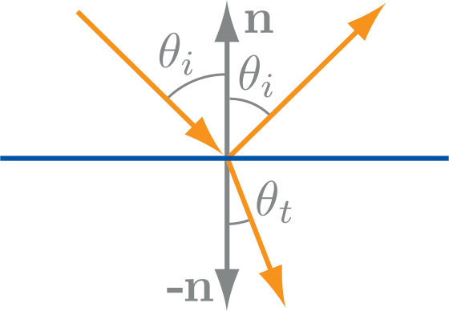
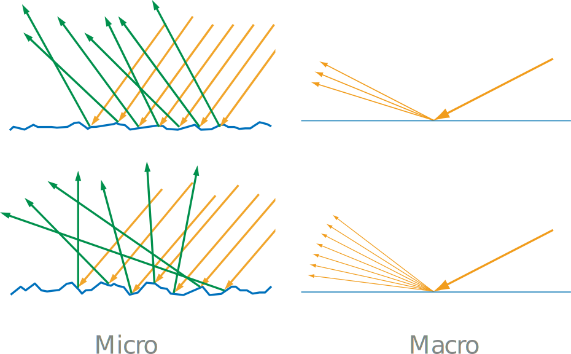
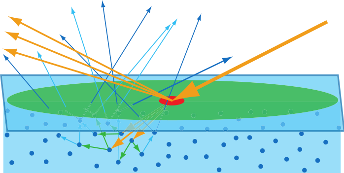
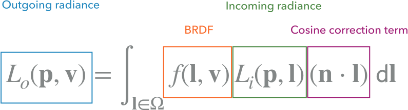
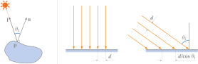
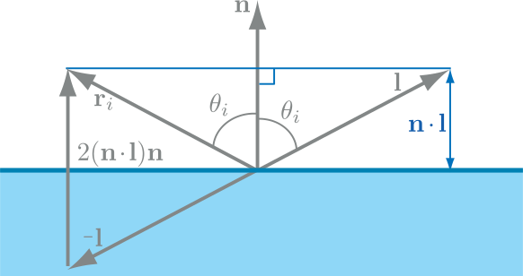
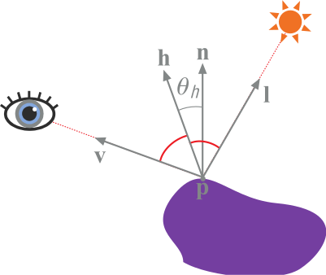

# Shading

Fundamentally, all light-matter interactions are the result of two phenomena: scattering and absorption.

Scattering happens when light encounters any kind of optical discontinuity. Scattering does not change the amount of light, it just causes it to change direction.

Absorption happens inside matter and causes some of the light to be converted into another kind of energy and disappear. It reduces the amount of light but does not affect its direction.

Materials with low scattering and absorption are transparent, transmitting any refracted light through the entire object.

## Metallic and Dielectrics

Metals reflect most incident light and immediately absorb any light propagating inside them.\
In non-metals (dielectrics) the refracted light continues to interact with the interior volume of the object and exhibit a wide variety of scattering and absorption behaviors.

## Scattering

Light incident on a flat surface scatters into a reflected part and a refracted part.

### Microgeometry

At the point a light ray intersects with a surface, the surface is treated locally as a flat plane. This is equivalent to assuming that all surface irregularities are either smaller than a light wavelength or much larger. When these irregularities are too small to be individually rendered we refer to them as microgeometry.\
The effect of the microgeometry is to change the normal at different points on the surface, thus changing the reflected and refracted light directions.

For rendering, rather than modeling the microgeometry explicitly, we treat it statistically and view the surface as having a random distribution of microstructure normals. The width of this spread, and thus the blurriness of reflected and refracted detail, depends on the surface roughness at the microscale.

### Subsurface Scattering (dielectrics)

In (dielectric) opaque objects, the transmitted light undergoes multiple scattering and absorption events until finally some of it is re-emitted back from the surface, at varying distances from the entry point. The distribution of entry-exit distances depends on the density and properties of the scattering particles in the material.

#### Local Subsurface Scattering (in light blue)

If the entry-exit distances are small compared to the shading scale, they can be assumed to be effectively zero for shading purposes. This allows subsurface scattering to be combined with surface reflection into a local shading model, with outgoing light at a point depending only on incoming light at the same point. Subsurface-scattered light has a significantly different appearance than surface-reflected light, due the non-negligible interaction with the material.

#### Global Subsurface Scattering

If the entry-exit distances are large compared to the shading scale, then specialized shading techniques are needed to capture the visual effect of light entering the surface at one point and leaving it from another.

---

## The BRDF

Given that we ignore the cases of transparency and global subsurface scattering, we can assume that, with the exception of light sources, the radiance leaving a surface is reflected, and originated from elsewhere.

*Local* reflectance depends on only the incoming light direction $l$ and the outgoing view direction $v$, and is quantified by the **b**idirectional **r**eflectance **d**istribution **f**unction, denoted as $f(l,v)$ or $f(\theta_l,\phi_l,\theta_v,\phi_v)$. $l$ and $v$ have two degrees of freedom each: elevation $\theta$ relative to the surface normal $n$ and azimuth $\phi$ (we assume a right-handed direction). The BRDF is defined only in cases where both the light and view directions are above the surface.

We assume every point to have it's own BRDF.

### Isotropic BRDF

Isotropic BRDFs $f(\theta,\phi_l,\phi_v)$ depend only on the relative azimut angle between the the incoming and outgoing directions, so the surface appears the same when rotated along the normal. This usually is the case for most materials.

## The Reflectance Equation

The radiance $L_o(p,v)$ of a given point $p$ for an outgoing direction $v$ is equal to the integral over all possible incoming directions $\mathrm dl$ in the hemisphere (solid angle):

Likewise, the reflectance for a given incoming direction $l$ is equal to the integral over all possible outgoing directions $\mathrm dv$ in the hemisphere:

$$
R(l)=\int_{v\in\Omega}f(l,v)(n\cdot l)\thickspace\mathrm dv
$$

### The cosine correction term

In irradiance\radiance, the area is measured in a plane perpendicular to the ray. If radiance is applied to a surface at some other orientation, then a cosine correction factor must be used.

Intuitively, the irradiance is proportional to the density of the rays and inversely proportional to the landing distance $d$ between them, so, $\frac{E}{d/cos(\theta_i)}=E\,\mathrm{cos}(\theta_i)$. We can use the dot product of $l$ and $n$ to compute $\mathrm{cos}(\theta_i)$.

### Local vs Global Illumination

The $L_i(p,l)$ (incoming radiance) term in the reflectance equation represents light impinging upon the shaded surface point from other parts of the scene. In realistic scenes, $L_i(p,l)$ includes nonzero radiance from all directions, whether emitted directly from light sources or reflected from other surfaces.

#### Global Illumination

Global illumination algorithms calculate $L_i(p,l)$ by simulating how light propagates and is reflected throughout the scene. These algorithms use the rendering equation, of which the reflectance equation is a special case:

$$
L_o(p,v)=L_e(p,v)+\int_{l\in\Omega}f(l,v)L_o(r(p,l),-l)(n\cdot l)\thickspace\mathrm dl
$$

* $L_e(p,v)$ is the emitted radiance from the surface location $p$ in direction $v$.
* The substitution $L_i(p,l)=L_o(r(p,l),-l)$ means that the incoming radiance into location $p$ from direction $l$ is equal to the outgoing radiance from some other point in the opposite direction $−l$. In this case, the "other point" is defined by the ray casting function $r(p,l)$. This function returns the location of the first surface point hit by a ray cast from $p$ in direction $l$.

#### Local Illumination

Local illumination uses the reflectance equation to compute shading locally at each surface point. In local illumination algorithms is given and does not need to be computed.

### Diffuse and Specular

It's convenient to divide the BRDF definition into separate shading terms:

$$
f(l,v)=f_{\text{specular}}(l,v)+f_{\text{diffuse}}(l,v)
$$

The *specular* BRDF models surface reflection (yellow arrows), the *diffuse* BRDF models local subsurface scattering (light blue arrows).

## Simplified Shading Equation

In real-time rendering, it is quite common to make these simplifications of the reflectance equation:

* Only *direct illumination*, consider only light coming directly from light sources. Local lighting $L_i(p,l)$ is given.
* All points in surfaces see all light sources.
* All light sources are spheres with very small radii compared to their distance from the shaded surfaces (point light) (while real-world light sources are area lights that cover a nonzero solid angle).

With these simplification our reflectance equation becomes:

$$
L_o(p,v)=\pi f(l,v)c_{\text{light}}(n\cdot l)
$$

$c_{\text{light}}$ should be light irradiance, but for convenience, it is defined as a RGB value with unbounded range (each channel can be greater than 1). For more lights, just compute the sum of each light result.

* Directional Light:\
  In the case of directional light sources (such as the sun), both $l$ and $c_{\text{light}}$ are constant over the scene.
* Point Lights:\
  In the case of point lights and spotlights, both will vary. $c_{\text{light}}$ falls off as the inverse square of the distance to the light (in practice other falloff functions are often used).

### Specular reflection vector $r_i$

The direction of the reflected light $r_i$ forms the same angle with the surface normal $n$ as the incoming direction $l$:

$$
  r_i=-l+2(n\cdot l)=2(n\cdot l)n-l
$$

### The half vector $h$

Specular reflected light is seen from direction $v$ if $v$ form the same angle with the normal as $l$. This means the normal is halfway between $l$ and $v$, so $n=\frac{v+l}{|v+l|}=h$.

