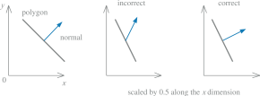

# Geometry processing

## [The Math behind (most) 3D games - Perspective Projection](https://www.youtube.com/watch?v=U0_ONQQ5ZNM)

* Clip space doesn't turn the frustum into a cube, it's just a 4D projective space $\mathbb P^4(\mathbb R)$. This is done by the perspective division, which brings us in NDC space (a projected affine space $\mathbb R^3$ with $x_{4}=1$).
* Clipping can be done in the clip space (by interpreting the homogeneous coordinates), or in NDC (interpreting the depth values). Clipping in NDC has the advantage that it's generic, as any projection technique can be brought to NDC.

## Normal transformations

A single matrix $A$ can be used to consistently transform points, lines, polygons, and other geometry. The same matrix can also transform tangent vectors following along these lines or on the surfaces of polygons. However, this matrix cannot always be used to transform one important geometric property, the surface normal:

The proper method is to use the transpose of the matrix's adjoint $\operatorname{adj}(A)^\mathsf T=(C^\mathsf T)^\mathsf T=C$.\
The traditional method is to use the transpose of the inverse $(A^{-1})^\mathsf T$. This method works only if $A$ is invertible, and computing the full inverse is often not necessary.

Even computing just the adjoint for a full $4\times4$ matrix can be expensive, and is usually not necessary.\
The normal is a vector and won't be affected by translations. Furthermore, most modeling transforms are affine, as they do not change the $w$ component of the homogeneous coordinate passed in (they do not perform projection tranformations).

Under these (common) circumstances, all that is needed is to compute the adjoint of the upper-left $3\times3$ components. Often even this is not required, if we know $A$ is exclusively the composition of translations, rotations, and uniform scaling operations (no stretching or squashing):

* Translation does not affect the normal.
* Intuitively, rotation does not deform normals. A rotation matrix $R$ is defined by the fact that $R^{-1}=R^\mathsf T$, so $(R^{-1})^\mathsf T=R$ and the original transform itself can be used directly to transform normals.
* The uniform scaling factor simply changes the length of the normal, but even then, fully renormalizing the normal produced is not always necessary: the overall scale factor (known or computed once) can be used to directly normalize the normals produced.
