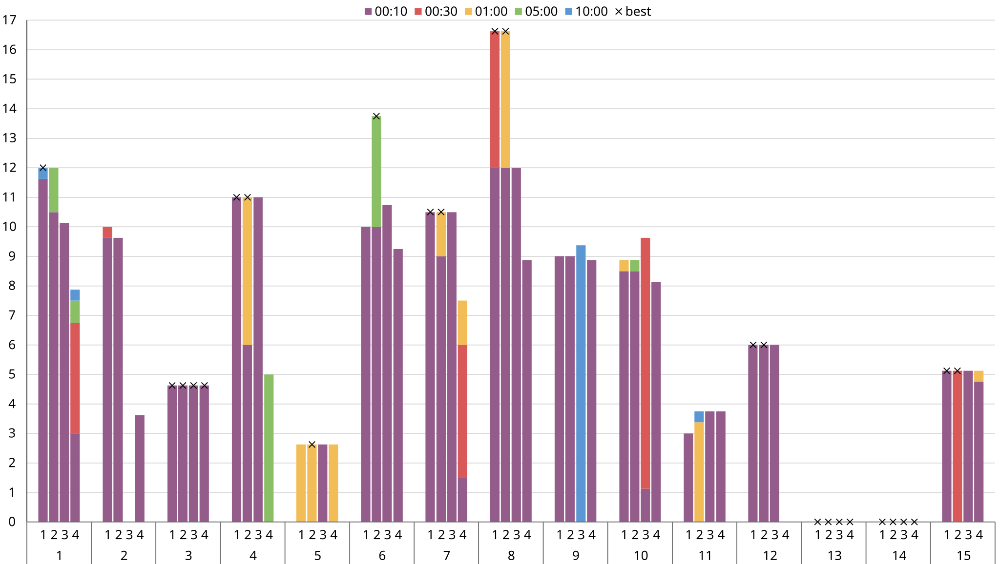
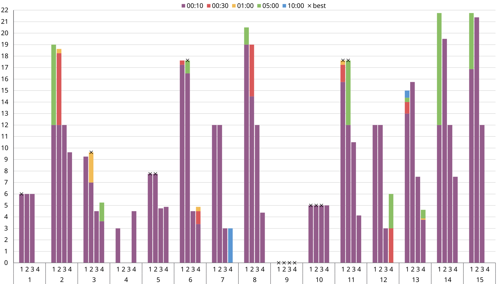
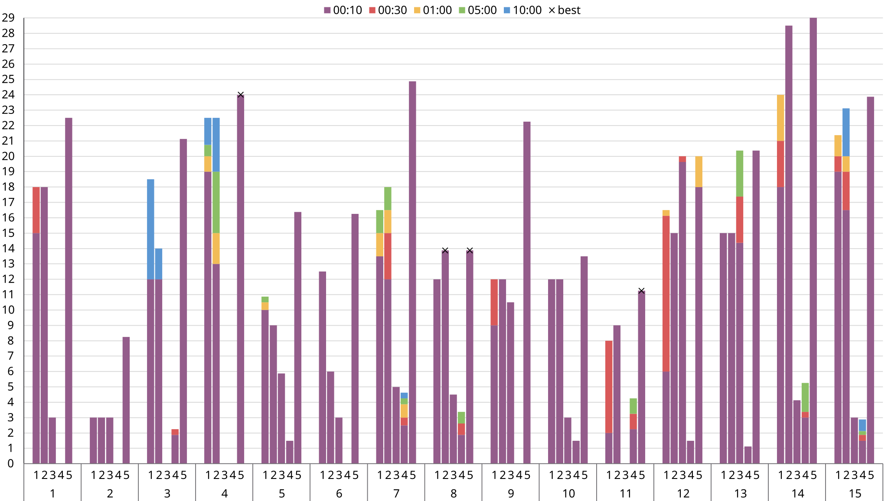
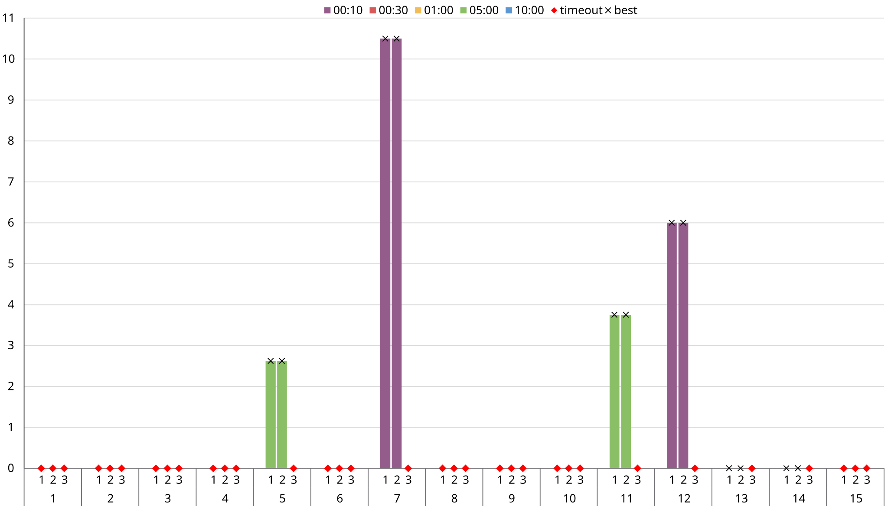
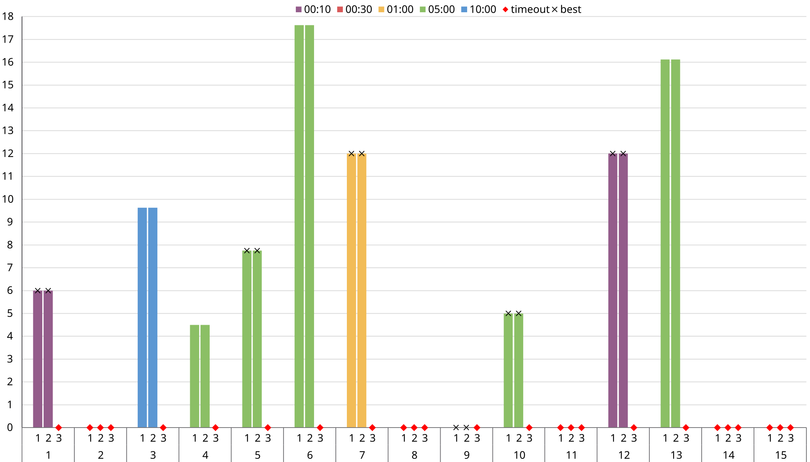

# Relazione

## Definizione del Problema

>Si dispone di $n$ damigiane uguali tra loro contenenti ciascuna $k$ litri di vino (dati di input) e di $h$ bottiglie $b_1,\dots,b_h$ di capacità $c_1,...,c_h$ (si pensi a casi realistici, in cui la bottiglia è tipicamente da $1/3$ di litro, $1/2$ litro, $3/4$ litro, $1$ litro, $1$ litro e $1/2$, etc.) Anche questi sono dati di input.\
Ci sono poi degli scatoloni per le bottiglie (ce ne sono illimitati) che si vuole spedire (non importa se con camion treno o altro). Gli scatoloni hanno dei limiti massimi di capienza in termini di bottiglie (si faccia qualche casistica ragionevole basata sui diametri delle bottiglie).
>
>Vogliamo riempire le bottiglie e imballarle in scatoloni "quasi" pieni. Il "quasi" significa che sono ammessi scatoloni che contengono un po' meno della quota massima (poni tu a caso, che so 1 litro). Le bottiglie vanno riempite per intero in base alla loro capacità ma non è necessario usarle tutte.
>
>L'obiettivo è di caricare, con i vincoli sopra e con le bottiglie a disposizione, la massima quantità di vino negli scatoloni. Se l'ultimo scatolone fosse troppo vuoto allora non viene trasportato, dunque quel vino per ora rimane in azienda (e dunque fa calare la quantità totale spedita).
>
>Si giochi un po' coi parametri per creare delle istanze ragionevoli.

Ho scelto di interpretare la specifica con taglio realistico, implementando dei vincoli verosimili in un contesto di imballaggio di bottiglie secondo queste osservazioni:

1. Le varietà di bottiglie di vino variano molto in dimensioni, in funzione alla capacità. Partendo da ~24x6cm (altezza x diametro) di una bottiglia da $1/3$ L ai ~35x9cm di una bottiglia da $1.5$ L. Ho quindi scelto di aggiungere le dimensioni rispettivamente $g_1,...,g_h$ e $d_1,...,d_h$ all'input, oltre alle capacità.

2. Le dimensioni delle bottiglie vengono impiegate in un sottoproblema di packing 2D nelle scatole. L'area occupata da ciascuna bottiglia è considerata un quadrato di lato $d_i$. Viene anche richiesto che l'altezza non superi quella della scatola.

3. Il concetto di "quasi pieno" è stato implementato come una percentuale minima di capienza sul volume della scatola. A causa della forma affusolata delle bottiglie, originariamente questo vincolo era stato interpretato come la superficie di scatola coperta. È stato sostituito poiché più verboso che interessante.

4. La funzione di costo è stata "arricchita" per preferire soluzioni con il minor numero di scatole utilizzate, a parità di vino imbottigliato.

5. L'input è espresso in formato "succinto", sotto forma di un "batch" per ciascun formato di bottiglie e rispettiva quantità. Come su knapsack, formalmente ciò aggiunge un grado di esponenzialità sull'input.

## MiniZinc

> Durante lo sviluppo è emerso un bug nel compilatore MiniZinc tracciato su [919](https://github.com/MiniZinc/libminizinc/issues/919), e corretto dalla versione 2.9.3 del 23 Maggio 2025.

Per garantire una buona leggibilità e facilitare il "debugging" ho adottato il più possibile i comfort offerti dal linguaggio: record, funzioni, ed espressioni `let`.

* **Record**
  
  I record sono zucchero sintattico per raggruppare variabili correlate come "attributi" di un "oggetto". Sono utili in tutte le situazioni dove, altrimenti, servirebbero più array paralleli, uno per ciascun attributo, indicizzati dall'oggetto.\
Per specifica del linguaggio, I record di parametri e variabili vanno dichiarati separatamente e poi uniti con l'operatore `++` (i record devono avere attributi disgiunti).
* **Funzioni**

  Le funzioni in MiniZinc sono implementate come riscrittura, e nei modelli sono impiegate perlopiù come accessors. Come convenzione, uso il suffisso `_` sul nome delle funzioni *unsafe*, ovvero le funzioni che utilizzano `deopt()` e quindi vanno chiamate in un contesto dove è garantita la presenza della variabile opzionale.
* **Espressioni `let`**

  Le `let` expression permettono di dichiarare variabili in uno scope limitato. Il compilatore istanzia e disambigua le variabili ogni volta che viene invocata l'espressione. Vincoli sulle variabili locali vengono globalizzati fino a quanto permesso dalla semantica del linguaggio.

### Modello

Sono presentate più iterazioni/varianti, ma la struttura di base sono simili:

* **Batch**: dato in input, descrive un formato di bottiglia (capacità, altezza, diametro) e annessa quantità disponibile.
* **Box Size**: dato in input, descrive un formato di scatola (larghezza, profondità, altezza, capienza minima).

I batch in input vengono "srotolati/espansi" in bottiglie individuali. Le bottiglie sono implementate come `record`, ciascuno con i relativi attributi. Ogni record contiene anche l'indice della scatola in cui è piazzata la bottiglia, assieme alle coordinate `x` `y`. Il modo di esprimere che una bottiglia non è in alcuna scatola varia in base al modello.

Si nota che in MiniZinc, per specifica, la "duplicazione" di parametri è solo sintattica e, in genere, non ha effetti sul compilato. Questo è stato osservato sperimentalmente confrontando il compilato con un'implementazione alternativa dove ogni bottiglia memorizzava solo un indice al batch corrispondente.

Dove possibile, i modelli esprimono vincoli direttamente sul dominio delle variabili; per esempio la quantità di vino a disposizione:

```ocaml
var 0..demijohns_number*demijohn_capacity: bottled_wine = sum (i in used_bottles) (capacity(i));
```

In ogni caso, una delle operazioni che svolge il compilatore è la "bounds analysis", dove i domini delle variabili vengono propagati e limitati da eventuali disequazioni unarie (non è specificato se tramite interval analysis/interpretazione astratta o qualcosa di più semplice, quindi ho deciso di farlo esplicitamente dove possibile).

#### Funzione di costo

MiniZinc non supporta nativamente l'ottimizzazione lessicografica come ASP/clingo, perciò va implementata manualmente usando un coefficiente (unità) maggiore del massimo valore della sotto-unità.

Sono presentate quattro iterazioni di modello MiniZinc.

### Modello "fat" (`model-fat.mzn`)

Il modello fat è principalmente un modello esplorativo, ha una struttura versatile e offre più implementazioni alternative per alcuni vincoli, al prezzo di un compilato appesantito.

#### Global constraints

Le osservazioni principali riguardano il global constraint `diffn_nonstrict()`, che esprime la condizione di non-sovrapposizione di rettangoli in 2D. La variante `nonstrict` ignora i rettangoli di larghezza 0.

Nei test, si è visto che `diffn_nonstrict()` portava a un peggioramento delle prestazioni. Il vincolo va istanziato per ogni scatola, limitato alle bottiglie attualmente nella scatola; questa dinamicità, unita alla "conversione" delle strutture dati per soddisfare la segnatura, porta ad un notevole aumento delle variabili nel modello.

```ocaml
let {
        var set of uint: boxed_bottles = {j | j in domain where bottles[j].box = i};
        list of var uint: rect_widths = [if i in boxed_bottles then diameter(i) else 0 endif | i in index_bottles];
      }
```

Verranno discussi successivamente più in dettaglio i costi di comprehensions come queste.

#### Packing sulla distanza

Il modello offre anche la possibilità di usare un packing basato sulla distanza. Questo approccio è stato scartato poiché, oltre a generare disposizioni intricate poco "pratiche", potenzialmente introduce variabili floating point nel modello altrimenti intero ($d_i/2$).

#### Symmetry breaking

Nella sezione `% symmetry breaking` ci sono delle tracce di vincoli di symmetry breaking (commentate). In pratica, nessun vincolo del genere ha portato miglioramenti delle prestazioni.

#### Variabili d'appoggio vs funzioni

```ocaml
function var set of index_bottles: used_bottles() = {i | i in index_bottles where occurs(bottles[i].box)};
function var set of index_bottles: used_boxes() = {box_(i) | i in index_bottles where occurs(bottles[i].box)};
```

È stato verificato sperimentalmente che la dichiarazione di variabili d'appoggio è vantaggiosa rispetto a racchiudere una comprehension "calcolata" in una funzione helper. Il numero di variabili dipende molto di più dalle espressioni che dal numero di variabili *dichiarate* in MiniZinc. Il compilatore applica in ogni caso *common subexpression elimination*.

In un'istanza d'esempio è stato osservato un leggero incremento (10%) del compilato, altri benchmarks sono disponibili nella cartella `benchs` con seed `542355655`.

### Modello "minimal" (`model.mzn`)

Il modello minimal rimuove un "livello" di variabili `opt`, e in aggiunta applica varie ottimizzazioni sull'implementazione dei vincoli. Negli altri modelli, ogni bottiglia può avere o meno un riferimento a una scatola `box`, similmente le scatole stesse sono `opt`. In questo modello ciascuna bottiglia è sempre associata ad una scatola, quindi l'unico modo di esprimere che è inutilizzata è piazzarla in una scatola disattivata (ciò si basa sull'osservazione che o ogni scatola contiene una bottiglia, o c'è una scatola disattivabile).

Questo modello ha il compilato più piccolo, qui un esempio per la seguente istanza:

| batches  |          |        | boxes  |       |        |        |               |
| -------- | -------- | ------ | ------ | ----- | ------ | ------ | ------------- |
| quantity | capacity | height | height | width | length | height | min_occupancy |
| 2        | 375      | 24     | 6      | 20    | 17     | 35     | 10            |
| 4        | 1000     | 32     | 8      | 13    | 13     | 25     | 40            |

| modello   | righe FlatZinc |
| --------- | -------------- |
| fat       | 2103           |
| minimal   | 1166           |
| channeled | 1402           |

#### Ottimizzazioni

La documentazione di MiniZinc [menziona](https://docs.minizinc.dev/en/stable/optiontypes.html#hidden-option-types) pattern che possono introdurre variabili superflue:

```ocaml
var set of 1..n: x;
array[1..n] of var int: y;

constraint sum(i in x)(i) <= limit;
constraint forall(i in 1..n where y[i] >= 0)(y[i] <= limit);
```

È zucchero sintattico per:

```ocaml
constraint sum(i in 1..n)(if i in x then i else <> endif) <= limit;
constraint forall(i in 1..n)(if y[i] >= 0 then x[i] <= limit else <> endif);
```

Dove, a loro volta, le *generator expressions* sono zucchero sintattico per array comprehensions di `var opt`. Il passaggio per array intermedi permette di usare in maniera trasparente i constraint la cui segnatura accetta array di optional. Nel caso ciò non sia richiesto, è meglio mantenere la logica a livello di vincolo:

```ocaml
constraint sum(i in 1..n)(bool2int(i in x)*i) <= limit;
constraint forall(i in 1..n)(y[i] >= 0 -> x[i] <= limit);
```

Un'altra ottimizzazione consiste nel sfruttare il più possibile le varie coercion offerte dal linguaggio, sia implicite che esplicite. Ad esempio, i `var set` vanno utilizzati con attenzione poiché "nascondono" l'implementazione basata su array; d'altra parte, questo rende gli array di `var opt` sono compatibili con `var set` tramite `array2set()`.

Si nota che non è comunque garantito che le coercion siano completamente statiche: `bool2int()`, per esempio, è reificato in una variabile booleana che assume il valore dell'espressione in input e una variabile intera vincolata.

Le iterazioni su `var set` sono tra le operazioni che più appesantiscono il modello fat.

### Modello "channeled" (`model-channeled.mzn`)

Il modello channeled essenzialmente reintroduce l'opzionalità sugli attributi `box` delle bottiglie, dopo aver osservato le prestazioni inferiori alle aspettative del modello minimal.

La documentazione MiniZinc definisce "channeling" i design pattern dove il modello mantiene due o più "prospettive" sulla soluzione, permettendo di scrivere vincoli più semplici. Purtroppo nessun "channeling constraint" offerto nativamente dalla libreria si adattava al problema.

L'array delle scatole è vincolato debolmente:

```ocaml
constraint forall (i in index_bottles) (occurs(bottles[i].box) -> occurs(boxes[bottles[i].box]));
```

Una scatola può essere attiva anche se senza bottiglie. Questa scelta è stata intenzionale poiché un vincolo sse sarebbe stato pesante (`forall boxes not box` $\implies$ `forall not bottles.box`, banalmente $\neg\exist\equiv\forall\neg$), e il solver è libero di "potare" le scatole per migliorare l'obiettivo secondario.\
In pratica, il vincolo di `occupancy()` impedisce l'esistenza di scatole vuote inutilizzate, e il numero di scatole utilizzate viene calcolato dalla soluzione ignorando questo valore.

Si nota che le set comprehension, invece, generano implicitamente vincoli sse sugli elementi. Il modello fat sfrutta questa proprietà su `used_boxes`.

La mia interpretazione riguardo la differenza di prestazioni, nonostante le dimensioni del compilato, è che le variabili del modello minimal hanno effetti meno diretti, con conseguenze "a cascata".\
Per esempio, il solver non può rimuovere gli assegnamenti direttamente alle bottiglie ma deve intervenire attraverso l'attivazione/disattivazione di scatola intere. Un concetto simile è anche menzionato nella documentazione MiniZinc.

#### Euristiche

Questo modello si è rivelato il più performante, ed è quello su cui ho testato varie euristiche sulle istanze più grandi, nel gruppo 3. Attivare la large neighbourhood search ha portato miglioramenti notevoli, ho usato `restart_luby()` con coefficiente 7, e 50 come probabilità percentuale in `relax_and_reconstruct()` (parametri calibrati sul gruppo 3). In pratica, queste euristiche andrebbero parametrizzate sperimentalmente sulle proprietà dell'istanza; qui ho usato una semplice condizione grossolana che disattiva LNS sulle istanze "piccole", in modo di permettere al solver di trovare l'ottimo.

Non sono riuscito invece ad accelerare il solving intervenendo nell'ordine di ricerca con [`seq_search()`](https://docs.minizinc.dev/en/stable/fzn-spec.html#search-annotations). Ho lasciato dei tentativi commentati.

### Modello "flat" (`model-channeled-unrolled.mzn`)

Il modello flat è un'iterazione del modello channeled dove le scatole non sono un riferimento variabile al tipo, ma vengono invece pre-generate staticamente. Invece di avere disposizione $h$ scatole, se ne hanno $h$ $*$ i tipi di scatola disponibili.

Le variabili di tipo `record` non possono essere `opt`, quindi per tenere traccia delle scatole usate ho usato un `var set` con dominio l'index set, sostanzialmente equivalente ad un vettore di opzionali, a patto di non iterarci sopra (un'alternativa sarebbe stata un array di booleani, che però non offre un equivalente nativo a `card()`).

### Benchmark

Vengono presentate 15 esecuzioni di ciascun modello su 3 gruppi di istanze "simili" in dimensioni. Il colore indica il miglior risultato entro il timeout. Gli indicatori se il solver ha dimostrato l'ottimo.

1. *flat*
2. *channeled*
3. *minimal*
4. *fat*
5. *channeled* con large neighbourhood search

#### 10 bottiglie, 2 scatole



#### 12 bottiglie, 2 scatole



#### 16 bottiglie, 3 scatole



#### Tempi medi di esecuzione

| modello | gruppo 1     | gruppo 2     | gruppo 3     |
| ------- | ------------ | ------------ | ------------ |
| 1       | 04:40.98     | 06:43.37     | 10:00.07     |
| **2**   | **04:19.43** | **06:29.77** | **09:20.30** |
| 3       | 08:00.05     | 08:40.07     | 10:00.02     |
| 4       | 08:00.08     | 09:20.06     | 10:00.08     |
| **5**   |              |              | **06:04.52** |

## ASP

In ASP, l'ostacolo principale è dato dal grounding, probabilmente esacerbato dai sottoproblemi di packing (potrebbe aiutare leggermente ridurre la precisione dei posizionamenti).

A differenza di MiniZinc, ASP non ha un preprocessor quindi eventuali indici/identificatori vanno inferiti dal solver. È sempre possibile processare l'input esternamente, ma a scopo di confronto ho deciso di usare strutture equivalenti.

### Modello "nativo" (`model.lp`)

Il modello nativo si chiama così perché introduce il minimo numero di termini necessario a disambiguare gli atomi.

Si nota che le variabili `X` e `Y` nella regola che produce l'atomo `placed()` sono considerate *unsafe* dall'analizzatore statico *clinlint*; dato che clingo le accetta senza errori, la regola è stata mantenuta così com'è nel modello finale.

La versione safe secondo clinlint produce un ground leggermente più grande:

```hs
x(0..(MaxWidth-MinDiameter)) :-
MinDiameter = #min{Diameter : batch(_, _, Diameter, _)},
MaxWidth = #max{Width : boxSize(Width, _, _, _)}.

y(0..(MaxLength-MinDiameter)) :-
MinDiameter = #min{Diameter : batch(_, _, Diameter, _)},
MaxLength = #max{Length : boxSize(_, Length, _, _)}.

1 {
    placed(B, Capacity, BHeight, Diameter, O, Width, Length, OHeight, MinOccupancy, X, Y) :
        X + Diameter <= Width,
        Y + Diameter <= Length,
        BHeight <= OHeight,
        box(O, Width, Length, OHeight, MinOccupancy),
        x(X),
        y(Y)
} 1 :-
bottle(B, Capacity, BHeight, Diameter).
```

### Modello "flat" (`model-unrolled.lp`)

Il modello flat cambia la struttura delle regole in modo da imporre la creazione di tutti gli atomi `bottle()` e `box()`, rendendo invece opzionale l'atomo `placed()`.\
Questa modifica ha portato a una riduzione delle dimensioni del ground.

### Modello "indexed" (`model-indexed.lp`)

Il modello indexed è un'iterazione del modello flat che impone l'associazione di un indice univoco ad ogni bottiglia. Il modello chiaramente peggiora dal punto di vista della complessità, ma volevo esaminare l'effetto sulle dimensioni del ground (l'atomo `placed()`, il più numeroso si semplifica).

### Benchmark

Vengono presentate 15 esecuzioni di ciascun modello su 2 gruppi di istanze "simili" in dimensioni. Il colore indica il miglior risultato entro il timeout. Gli indicatori neri se il solver ha dimostrato l'ottimo, rossi per timeout al grounding.

1. *nativo*
2. *flat*
3. *indexed*

#### 10 bottiglie, 2 scatole



#### 12 bottiglie, 2 scatole



#### Tempi medi di esecuzione

L'API di clingo fornisce le statistiche solo quando il solver termina autonomamente, tuttavia, è comunque visibile come mediamente il 91.31% del tempo è speso nel grounding:


Interessante notare che il solver clasp riesce a dimostrare l'ottimo più spesso di MiniZinc sulle istanze più grandi.

| modello | gruppo 1     | gruppo 2     |
| ------- | ------------ | ------------ |
| 1       | 06:51.50     | 06:58.62     |
| 2       | **06:51.07** | **06:50.62** |
| 3       | 10:00.00     | 10:00.00     |

## driver.py

Un obiettivo che avevo per questo progetto era utilizzare le API offerte dai solver, per vedere che aspetto avrebbe un'integrazione in un programma reale. Difatti ha impiegato più della metà del tempo totale di sviluppo. Ho scelto il linguaggio Python 3 perché portabile ed ergonomico.

Il pacchetto MiniZinc per Python è un semplice wrapper che comunica con l'eseguibile in IPC. È chiaramente orientato per automatizzare esperimenti, ed è quindi molto semplice e ben integrato con Python.

Il pacchetto clingo per Python è più interessante perché è un thin wrapper sulla libreria nativa di clingo. Viene offerto un enorme controllo e possibilità di modifica della pipeline, inclusa manipolazione dell'AST, hooks, etc.\
L'interoperabilità con Python è ben gestita, e vengono offerte API asincrone che rilasciano il Global Interpreter Lock per poter usare multithreading. L'unica critica è che la funzione di grounding non ha ricevuto la stessa attenzione, è bloccante in codice nativo. Nel mio caso dove i tempi sono dominati dal grounding, ciò di fatto nega tutte le accortezze menzionate sopra, e sono dovuto passare a multiprocessing con serializzazione.

Le istanze sono generate secondo i parametri di configurazione in `config.py`, sulla funzione `main()` in `driver.py` è possibile commentare/scommentare l'esecuzione delle varie varianti di modello. `driver.py` va eseguito con la root di questa repository come working directory.

Per eseguire i test richiesti dalla consegna, chiamare `make demo`, è necessaria una distribuzione pressoché aggiornata di Python.
