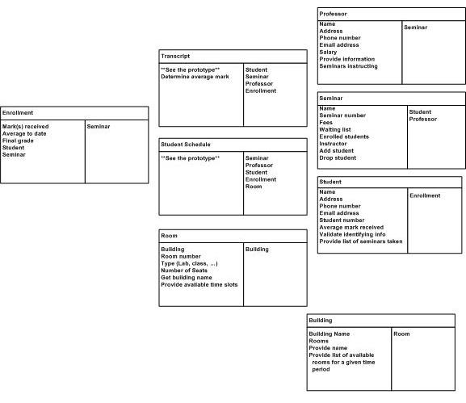

# Class Responsibility Collaborator Models

A Class Responsibility Collaborator model is a collection of standard index cards that have divided into three sections: Class Name, Responsibilites and Collaborators. A class represents a collection of similar objects, a responsibility is something that a class **knows** or **does**, and a collaborator is another class that a class interacts with to fulfill its responsiblities.

